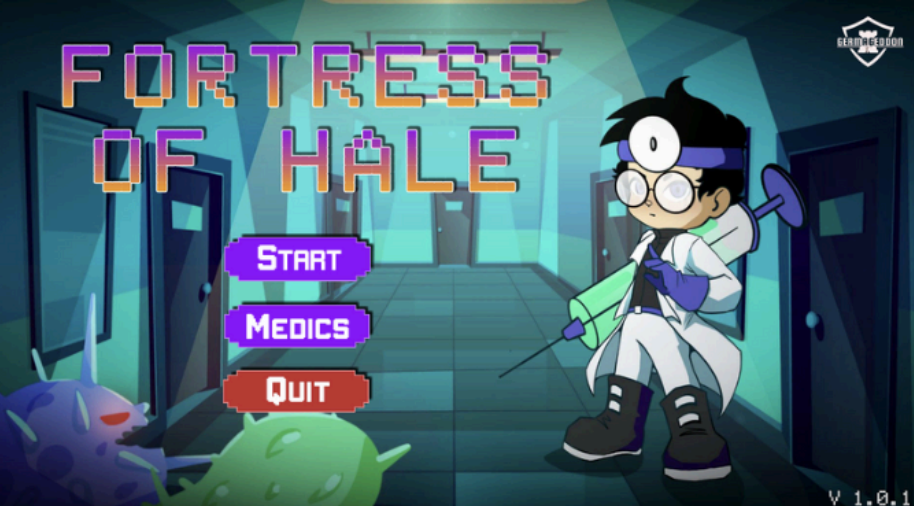
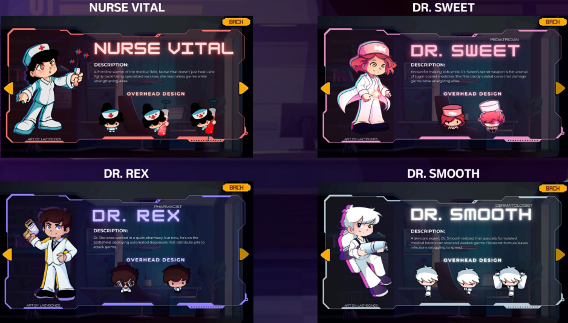
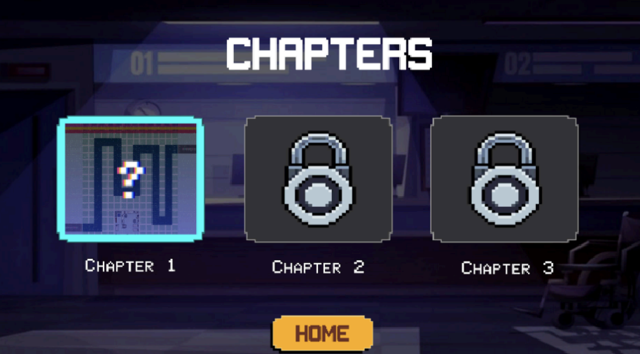

# Fortress of Hale: Medical Tower Defense
An educational tower defense game that raises awareness about microplastic contamination in food and its effects on human health, built as a team project following the Agile SDLC.

## 🎯 Project Objective
The goal of this project is to spread awareness of microplastic contamination in food and its health impact through interactive, game-based learning, making a complex environmental issue accessible and engaging for players aged 13 and up.

## 🛠️ Technologies Used
- Unity 2D
- Figma
- HTML & CSS

## 🔍 Project Workflow
1. Requirements Gathering & Stakeholder Analysis
2. UI/UX Design & Mockups
3. Game Development (Unity 2D)
4. Content Integration (Story Chapters & Health Data)
5. Testing & Bug Fixing
6. Deployment

## 🎮 Screens Implemented
- Main Menu
- Medic
- Chapter Selection
- Game UI
- Bad Ending (with restart option)

## 📸 Screenshots
### Main Menu

### Medics

### Chapter Selection

### Game UI

## 🧪 Testing
| Test Case | Description | Status |
|---|---|---|
| TC01 | Music implementation & bad ending | ✅ Pass |
| TC02 | Game UI functionality | ✅ Pass |
| TC03 | Home & Exit buttons on Game UI | ✅ Pass |
| TC04 | Home button on Chapter Selection | ✅ Pass |

## 💡 Key Takeaways
Developing this project reinforced the importance of grounding a game in a specific, real-world problem before designing around it. Combining a pressing health/environmental issue with tower defense mechanics showed how gamified learning can make complex topics like microplastic contamination both educational and engaging.
